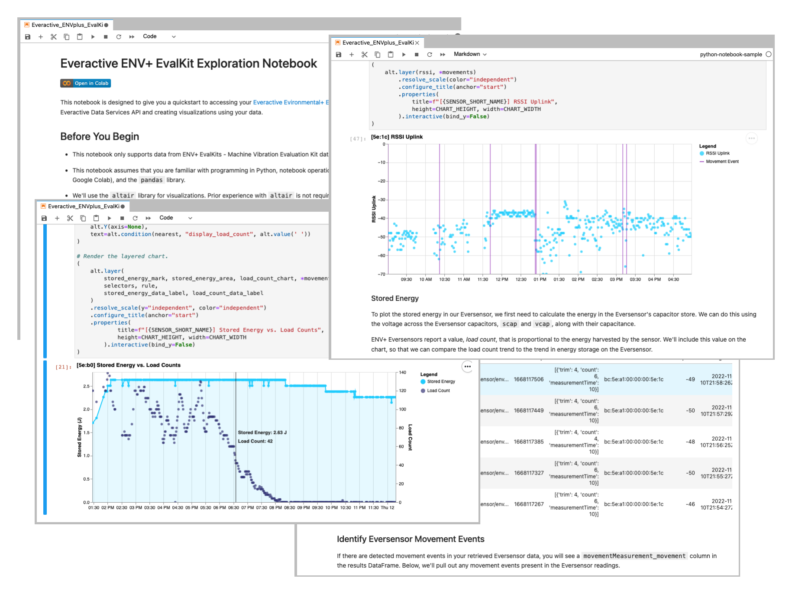

# python-notebook-sample

This repo contains a sample Python notebook that showcases how you can connect to the <a href="https://docs.api.everactive.com/reference/data-services-api-overview">Everactive Data Services API</a>, pull data generated by your <a href="https://everactive.com/product/environmental-evaluation-kit/">Everactive ENV+ EvalKit</a>, and visualize that data.

 

The notebook can be run locally with Docker or on the cloud in Google Colab:
 

    <a href="docs/how_to_run_in_docker.md">
        
        <b>Instructions for running in Docker</b>
    </a>

    

