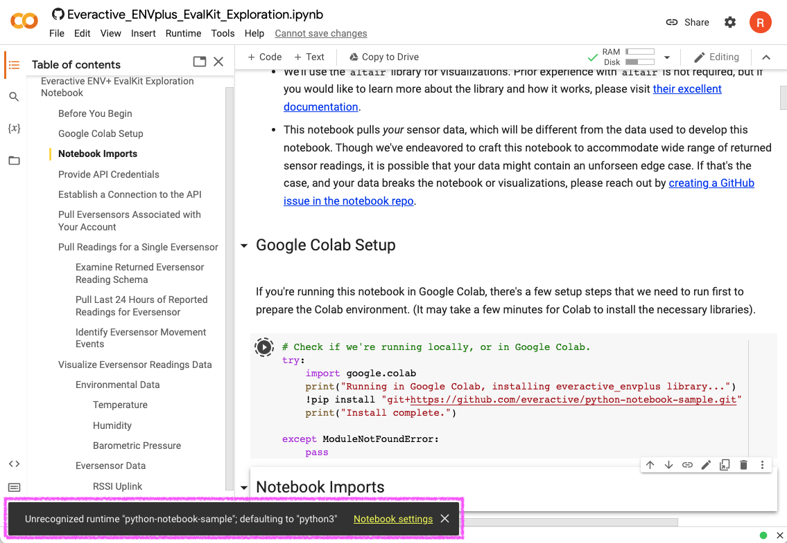

# How to Run the Everactive ENV+ EvalKit Exploration Notebook in Google Colab

Google Colaboratory ("Colab" for short) is a Google product that provides free cloud compute resources to run interactive notebooks. Colab provides an easy way to run the Everactive ENV+ EvalKit Exploration Notebook in the cloud, instead of locally on your machine.

## Launch the Notebook in Colab
There are two ways to launch the notebook in Colab, either from GitHub or from Colab.

### Launch from GitHub
Navigate to the [notebook file within this GitHub repo](https://github.com/everactive/python-notebook-sample/blob/main/notebook/Everactive_ENVplus_EvalKit_Exploration.ipynb), and click the `Open in Colab` badge on the notebook. This will launch the notebook in Colab for you.

### Launch from Colab
Navigate to [Google Colab](https://colab.research.google.com/).

1. Select the GitHub tab in the welcome dialog box.
1. Enter the repo url, `https://github.com/everactive/python-notebook-sample`, and click the magnifying glass.
1. The repo and branch data will populate, make sure the `main` branch is selected.
1. Click on the notebook name, `notebook/Everactive_ENVplu_EvalKit_Exploration.ipynb`, and Colab will launch the notebook.

   

## Run the Notebook in Colab
1. Once the notebook is launched in Colab, it's helpful to expand the notebook Table of Contents by clicking on the icon in the upper lefthand menu.

   

1. Colab operation and navigation is very similar to JupyterLab; you can execute cells with `Shift+Enter`. Go forth and explore!

There are a few dialogs and notices to be aware of when running the notebook in Colab:

* When you run the setup cell in Colab, you will receive a warning dialog box, noting that you are running a notebook that was loaded from GitHub. Though this notebook merely checks as to whether it is running in Colab or not, it is always good (and prudent) practice to review any source code before running it in an environment that has access to your accounts and credentials.

   Feel free to review the notebook code and `everactive_envplus` library code in the [source `everactive/python-notebook-sample` repo](https://github.com/everactive/python-notebook-sample), and click "**Run anyway**" when you are ready to proceed.

   
   

* Once you start executing cells, you will see a popup message at the bottom of the screen: `Unrecognized runtime "python-notebook-sample"; defaulting to "python 3"`. This message can be safely ignored.
   
