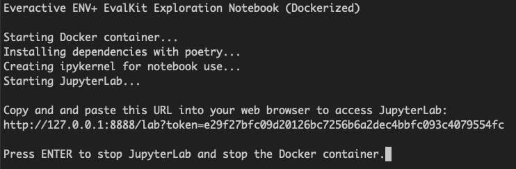
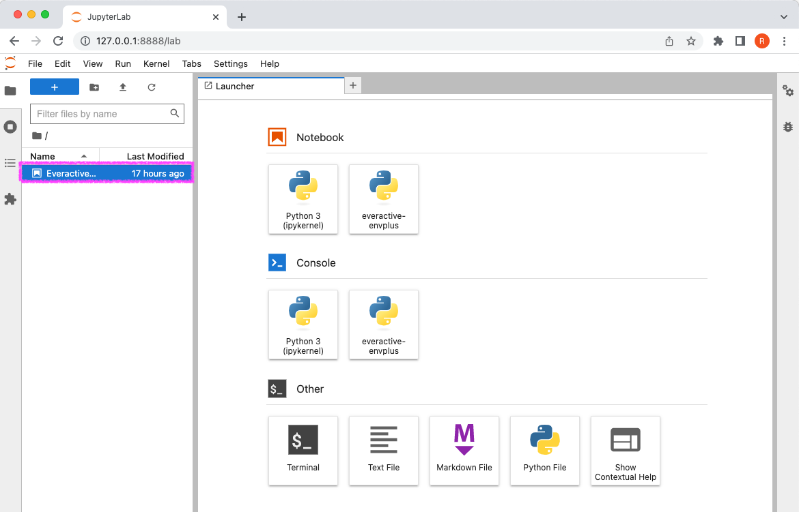
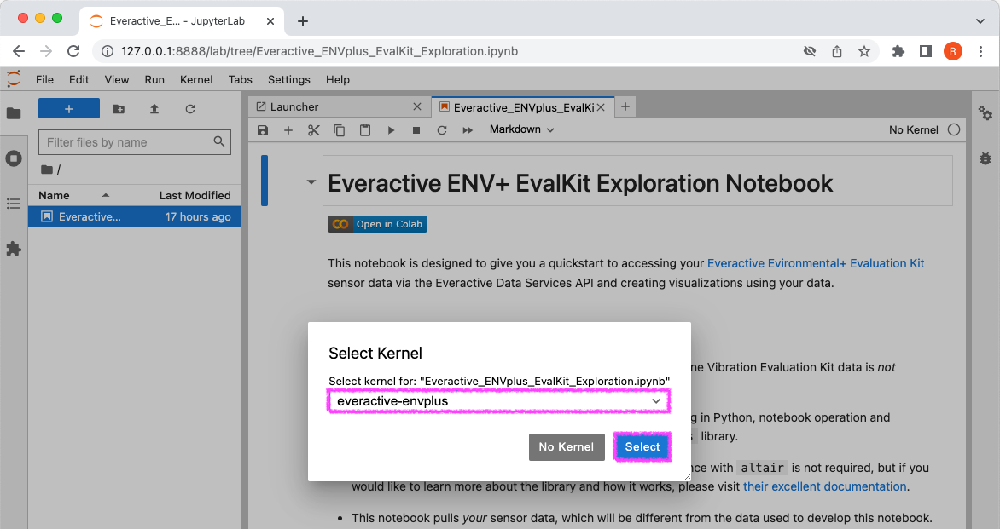
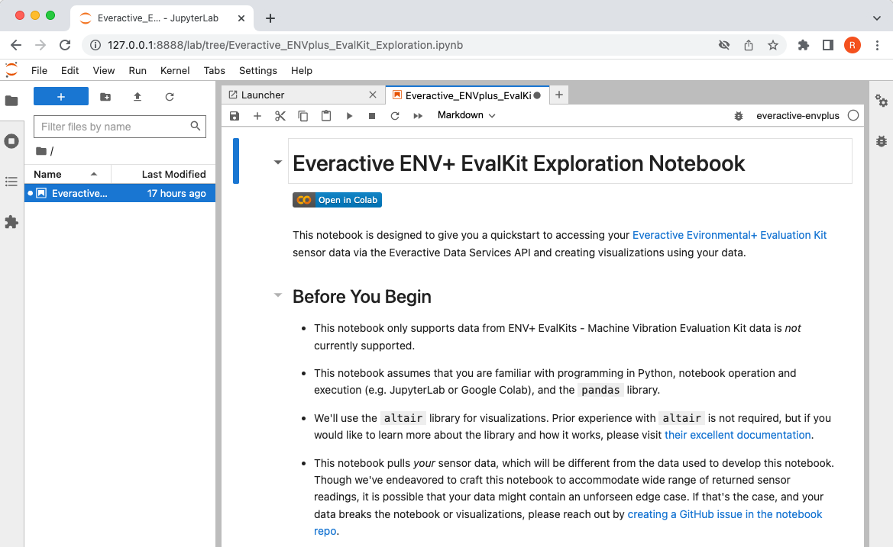
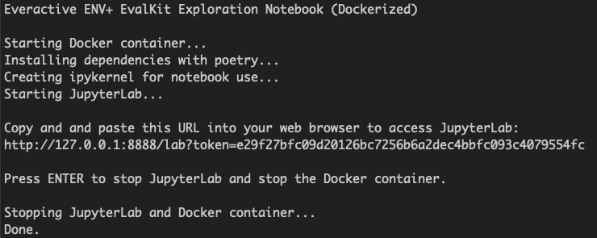

# How to Run the Everactive ENV+ EvalKit Exploration Notebook in Docker

We've created a Dockerized version of the notebook that can be run locally on your machine. This methodology has been tested on MacOS, running Docker Desktop, and using Chrome to interact with JupyterLab.

## Instructions

1. Clone the [notebook repo](https://github.com/everactive/python-notebook-sample) your local machine.

2. Open a terminal and navigate to the root directory of the cloned repo.

3. Run `./build.sh` to build the Docker container. The Docker build may take several minutes to complete.

4. Once the Docker image is built, run `./run.sh` to start the container. The run script will automate setup of the Docker container and JupyterLab server for you, and will expose the notebook so that you can interact with it via a local web browser on your computer.

When the script pauses after starting JupyterLab within Docker, you'll see the following output in the terminal:



5. Copy and paste the full localhost URL into your web browser of choice. In the example above, you would use the following URL:
```
http://127.0.0.1:8888/lab?token=e29f27bfc09d20126bc7256b6a2dec4bbfc093c4079554fc
```

Note that the JupyterLab URL token will change each time you rerun the Docker container.

6. Double click on the notebook name in the left-hand file browser menu to open it.



7. If you receive a dialog box prompting you to select a kernel, select the `everactive-envplus` kernel.


8. At this point, you are ready to run the notebook. Go forth and explore!


9. When your are done, just close the browser and return to the terminal. Press `Enter` to shut down the Docker container.

